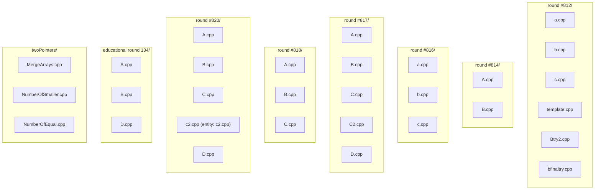

# Architecture Documentation

## Overview

This repository consists of a modular collection of standalone C++ source files containing competitive programming solutions and templates. The codebase is organized by specific contest rounds (e.g., Codeforces standard and educational rounds) and algorithmic topics (e.g., Two Pointers techniques).

All files in the codebase are completely decoupled; there are no cross-file dependencies or shared module imports indicated in the dependency graph.

---

## Directory & Module Structure

The codebase is organized into eight primary directories based on contest rounds or algorithmic categories:

### 1. `round #812/`
Contains solution attempts and template code for Round 812:
- `a.cpp`
- `b.cpp`
- `c.cpp`
- `template.cpp`
- `Btry2.cpp`
- `bfinaltry.cpp`

### 2. `round #814/`
Contains solutions for Round 814:
- `A.cpp`
- `B.cpp`

### 3. `round #816/`
Contains solutions for Round 816:
- `a.cpp`
- `b.cpp`
- `c.cpp`

### 4. `round #817/`
Contains solutions for Round 817:
- `A.cpp`
- `B.cpp`
- `C.cpp`
- `C2.cpp`
- `D.cpp`

### 5. `round #818/`
Contains solutions for Round 818:
- `A.cpp`
- `B.cpp`
- `C.cpp`

### 6. `round #820/`
Contains solutions for Round 820:
- `A.cpp`
- `B.cpp`
- `C.cpp`
- `c2.cpp` *(contains internal entity: `c2.cpp`)*
- `D.cpp`

### 7. `educational round 134/`
Contains solutions for Educational Round 134:
- `A.cpp`
- `B.cpp`
- `D.cpp`

### 8. `twoPointers/`
Contains algorithmic solutions focusing on the Two Pointers technique:
- `MergeArrays.cpp`
- `NumberOfSmaller.cpp`
- `NumberOfEqual.cpp`

---

## Component Relationships & Dependencies

- **Inter-file Dependencies**: None. Every file listed operates as an isolated executable or template file (`depends_on: []`).
- **Entity Identification**:
  - `round #820/c2.cpp` explicitly defines an internal entity `c2.cpp`.
  - All other files function without exported/declared entities registered in the dependency analysis.

---

## Architecture Diagram

The following diagram represents the directory organization and isolated file structure across the repository.

